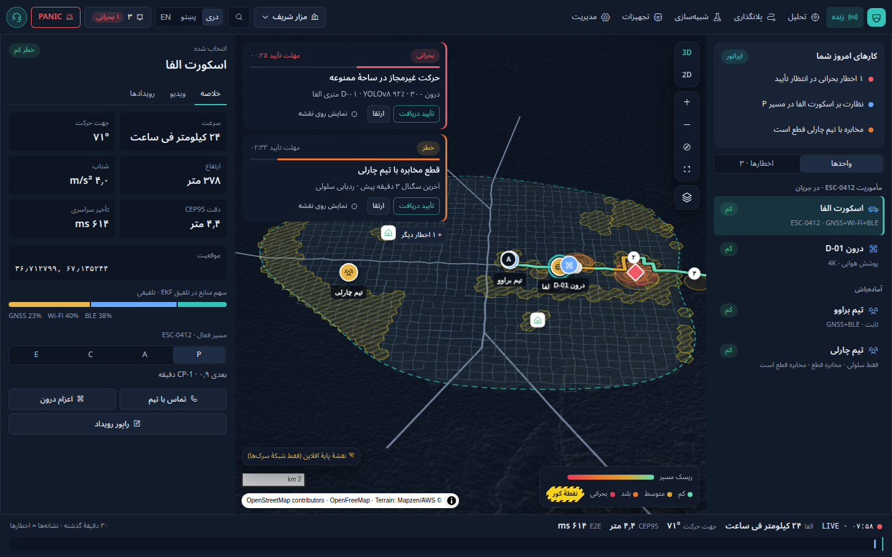
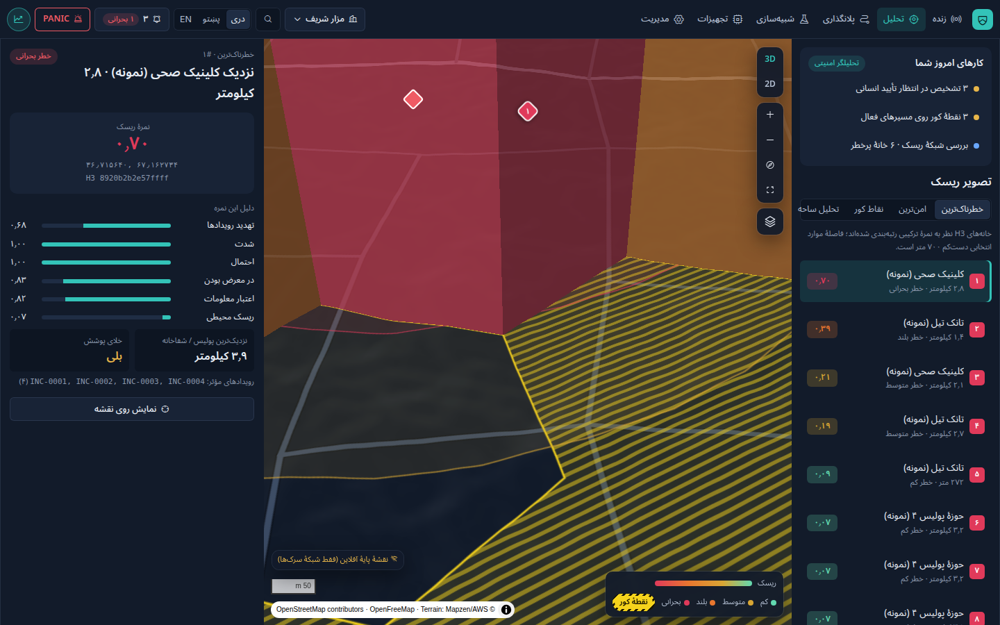
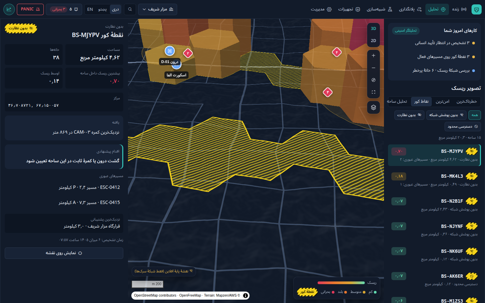
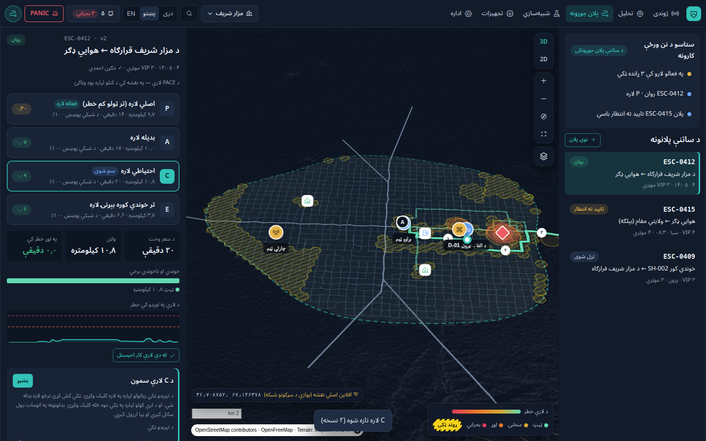
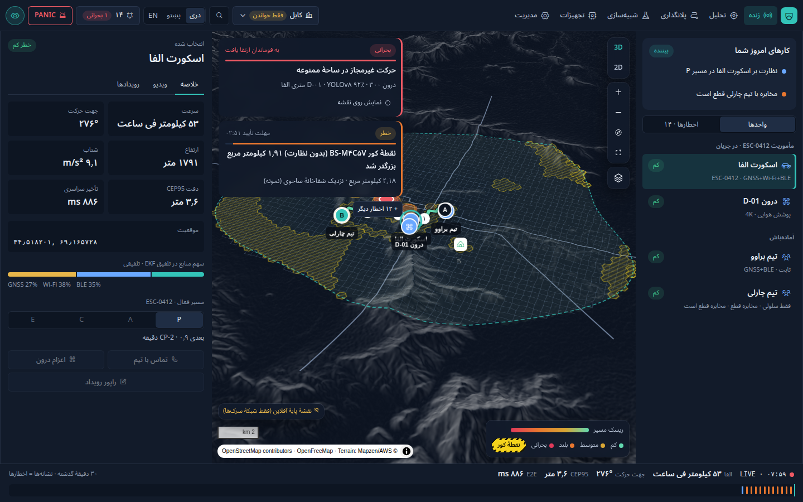
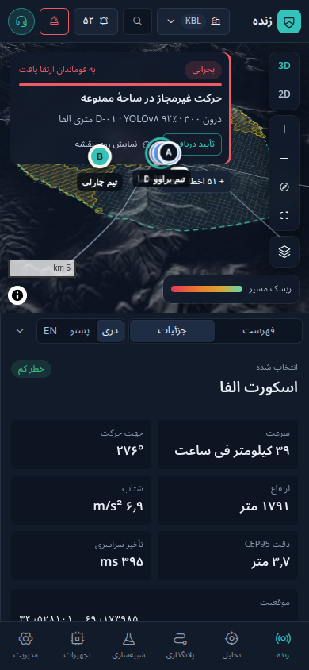

# راپور نهایی آزمایش · Final test report

**سیستم ارزیابی امنیتی محیط‌های عملیاتی** — شاخهٔ `claude/charming-pasteur-h8eowk` · تاریخ: ۶ میزان ۱۴۰۵ (۲۸ سپتمبر ۲۰۲۶)

> این راپور نتیجهٔ آزمایش‌های واحد، ادغام، کاربری (مرورگر) و کارایی را برای نُه نیازمندی مرحلهٔ دوم ثبت می‌کند.
> همهٔ معلومات عملیاتی (واحدها، رویدادها، پلان‌ها) **معلومات تمرینی** اند.

---

## ۱. خلاصه

| مجموعهٔ آزمایش | تعداد | نتیجه | زمان اجرا |
|---|---|---|---|
| آزمایش‌های واحد (vitest) | ۱۵۱ آزمایش در ۱۳ فایل | ✅ همه موفق | حدود ۳ ثانیه |
| آزمایش‌های ادغام (سرور واقعی + Socket.IO) | ۳۶ آزمایش در ۲ فایل | ✅ همه موفق | حدود ۱۰ ثانیه |
| آزمایش کاربری در مرورگر (Playwright) | ۳۲ آزمایش در ۴ فایل | ✅ همه موفق | ۴٫۶ دقیقه |
| آزمایش کارایی و پایداری (با بودجه) | ۱۲ بررسی | ✅ همه در حد بودجه | ۸۵ ثانیه |
| بررسی type (سرویس‌ها و داشبورد) | ۲ پروژه | ✅ بدون خطا | — |

در جریان آزمایش **۱۲ خطا** پیدا و رفع شد (بخش ۷). هیچ آزمایشی رد، غیرفعال یا نادیده گرفته نشده است.

## ۲. محیط آزمایش

| مورد | مقدار |
|---|---|
| سیستم | Linux x64، ۴ هستهٔ پردازنده (کانتینر ابری) |
| Node.js | 22.22 (محلی) · 20 (CI روی `ubuntu-latest`) |
| مرورگر | Chromium 141، WebGL نرم‌افزاری SwiftShader، حالت headless |
| ابزارها | vitest 1، Playwright 1.63، @axe-core/playwright 4.13، autocannon 7، socket.io-client 4.8 |
| نقشه | کاشی‌های خارجی در آزمایش مسدود اند تا نتیجه ثابت باشد؛ نقشهٔ پایهٔ آفلاین از شبکهٔ سرک‌های شعبه |
| معلومات جغرافیایی | شبکهٔ سرک ساختگی و علامه‌گذاری‌شده برای مزار شریف، کابل و هرات (دسترسی به Overpass در این محیط نبود) |

## ۳. انطباق با نیازمندی‌ها

| # | نیازمندی | آزمایش‌های پوشش‌دهنده | نتیجه |
|---|---|---|---|
| ۱ | نقشهٔ سه‌بعدی واقعی، حرکت روان، دقت مختصات ≤ ۵ متر | `geo-accuracy` (خطای رفت‌وبرگشت < ۰٫۵ متر، فاصلهٔ offset < ۰٫۱ متر تا ۱۴ کیلومتر، قالب ۶ رقم اعشاری < ۰٫۱۱ متر)؛ E2E `map` (بزرگنمایی، دوبعدی/سه‌بعدی، مختصات زیر نشانگر) | ✅ |
| ۲ | ارزیابی ریسک روی نقشه؛ مرکز پیش‌فرض مزار شریف با تمام شهر در دید | `risk-blindspots` (پوشش H3، کاهش با فاصله، ۱۰ خطرناک‌ترین و ۱۰ امن‌ترین با فاصلهٔ ≥ ۷۰۰ متر)؛ E2E: ≥ ۹۸٪ نقاط مرز شهر روی صفحه، پرواز به محل انتخاب‌شده | ✅ |
| ۳ | شعبه‌ها: معلومات جدا، سطح دسترسی، هماهنگ‌سازی، راپور جدا | `sync-users-reports` (حذف تکرار، آخرین نسخه، ذخیره‌وارسال هنگام قطع)، `ops-server` (جداسازی شعبه‌ها، خواندن منطقه‌ای)؛ E2E: رفتن قوماندان مرکز به کابل فقط‌خواندنی، رد دسترسی اپراتور کابل به مزار، راپور HTML هرات به پشتو | ✅ |
| ۴ | تشخیص خودکار نقاط کور، رنگ اخطار، راپور مفصل | `risk-blindspots` (بودجهٔ رادیویی، زاویهٔ کمره، ناحیه‌های پیوسته، خاموشی رله، بزرگ‌شدن ناحیه، شناسهٔ پایدار)؛ E2E راپور نقطهٔ کور | ✅ |
| ۵ | پلانگذاری حرکت اسکورت، مسیر امن/ناامن، ویرایش دستی | `routing` (A* برابر با Dijkstra کامل، یک‌طرفه، PACE، نقاط عبور، اخطارها، توقفگاه‌ها)؛ E2E: ساختن پلان، افزودن نقطهٔ عبور با کلیک روی مسیر، ارسال، تأیید قوماندان، نیاز به تأیید دوباره پس از ویرایش | ✅ |
| ۶ | رابط مدرن، واکنش‌گرا، سریع | `theme-contrast` (تضاد AA، طیف ریسک یکنواخت)؛ E2E: موبایل/تبلیت/دسکتاپ/دیوار بدون اسکرول افقی، axe بدون تخطی جدی، کیبورد؛ بودجهٔ ۲۰۰ کیلوبایت | ✅ |
| ۷ | حذف همهٔ اصطلاحات ایرانی | `i18n-guard` (۳۰ اصطلاح ممنوع در همهٔ فایل‌های مخزن؛ نبود کد محلی ایرانی و فایل `fa.json`) | ✅ |
| ۸ | سه زبان کامل، تبدیل بدون بارگذاری دوباره، ذخیرهٔ ترجیح | `i18n-guard` (برابری کلیدها و پارامترها در سه فرهنگ لغت، پیام‌های سرور)؛ E2E `language` (بدون reload، ذخیره روی سرور، انتقال به مرورگر دیگر، ارقام افغانی) | ✅ |
| ۹ | آزمایش جامع و راپور | همین سند | ✅ |

## ۴. آزمایش‌های واحد و ادغام

| فایل | تعداد | موضوع |
|---|---|---|
| `tests/unit/i18n-guard.test.ts` | ۴۰ | اصطلاحات ممنوع، برابری کلیدها، پوشش پشتو، پیام‌های سرور، ارقام |
| `tests/unit/theme-contrast.test.ts` | ۱۶ | تضاد رنگ WCAG AA در نمای تاریک و روشن، گام‌های روشنی طیف ریسک |
| `tests/unit/routing.test.ts` | ۱۴ | گراف سرک، A* بهینه، یک‌طرفه، PACE، دوری از خطر، نقاط عبور، اخطار نقطهٔ کور |
| `tests/unit/risk-blindspots.test.ts` | ۱۵ | شبکهٔ H3، سطوح ریسک، رتبه‌بندی، مدل رادیو و کمره، ناحیه‌ها، رله، شناسهٔ پایدار، نبود اخطار تکراری هنگام گشت درون |
| `tests/unit/risk-engine.test.ts` | ۱۴ | موتور ریسک پایه |
| `tests/unit/sync-users-reports.test.ts` | ۱۳ | هماهنگ‌سازی بین شعبه‌ها، کاربران و ترجیحات، راپور سه‌زبانه |
| `tests/unit/geo-accuracy.test.ts` | ۹ | دقت مختصات و هندسه |
| `tests/unit/simulation-engine.test.ts` | ۹ | ساعت مجازی و سناریوها |
| `tests/unit/alert-service.test.ts` | ۶ | چرخهٔ اخطار (تأیید دریافت، ارتقا، حل) |
| `tests/unit/realtime.test.ts` | ۵ | بافر رویداد و ادامه پس از قطع |
| `tests/unit/fusion-orchestrator.test.ts` | ۴ | تلفیق موقعیت |
| `tests/unit/auth-middleware.test.ts` | ۴ | JWT و محدودیت درخواست |
| `tests/unit/permissions-parity.test.ts` | ۲ | برابری صلاحیت‌های سرور و داشبورد |
| `tests/integration/ops-server.test.ts` | ۲۹ | سرور واقعی روی پورت تصادفی: ورود، شعبه‌ها، ریسک، نقاط کور، پلان، هماهنگ‌سازی، راپور، Socket.IO |
| `tests/integration/phase-2-message-bus.test.ts` | ۷ | قرارداد رویداد (۶ آزمایش)؛ آزمایش اتصال NATS بدون سرور NATS خودبه‌خود رد می‌شود |

## ۵. آزمایش کاربری در مرورگر (E2E)

سرور واقعی و داشبورد ساخته‌شده اجرا می‌شوند؛ هر آزمایش هر خطای جاوااسکریپت کنترول‌نشده را ناکامی حساب می‌کند.

- **زبان (۶):** سویچر در صفحهٔ ورود و همهٔ صفحات؛ `lang`/`dir` صفحه بدون بارگذاری دوباره تغییر می‌کند؛ ترجیح روی سرور ذخیره
  می‌شود و در مرورگر تازه (بدون localStorage) هم برمی‌گردد؛ ورود هر کاربر به زبان ذخیره‌شدهٔ خودش؛ ارقام افغانی در دری و پشتو.
- **نقشه (۶):** باز شدن روی مزار شریف با تمام محدودهٔ شهر؛ بزرگنمایی، دوبعدی/سه‌بعدی و «نمایش تمام شهر»؛ مختصات ۶ رقمی؛
  عدم تداخل راهنما، وضعیت نقشه، مقیاس و منبع در راست‌به‌چپ، چپ‌به‌راست و روی موبایل.
- **جریان‌های کاری (۷):** ۱۰ محل خطرناک و ۱۰ محل امن و پرواز به آن‌ها؛ راپور نقطهٔ کور که با حرکت درون از بین نمی‌رود؛
  چرخهٔ کامل پلان (ساختن ← ویرایش دستی روی نقشه ← ارسال ← تأیید قوماندان ← تأیید دوباره پس از ویرایش)؛
  اپراتور فقط می‌بیند؛ تبدیل شعبه؛ رد دسترسی بین شعبه‌ها؛ راپور چاپی هر شعبه.
- **کاربردپذیری (۱۳):** موبایل ۳۹۰، تبلیت ۸۲۰، دسکتاپ ۱۴۴۰ و دیوار ۲۵۶۰ پیکسل بدون اسکرول افقی و با سویچر زبان؛
  axe-core با معیار WCAG 2.1 A/AA در صفحهٔ ورود و سه بخش اصلی در نمای تاریک و روشن — **صفر تخطی جدی یا بحرانی**؛
  ورود و حرکت فقط با کیبورد با نشانگر تمرکز قابل دید؛ نخستین رسم صفحهٔ ورود کمتر از ۲٫۵ ثانیه و بارگذاری تأخیری بخش نقشه.

## ۶. آزمایش کارایی و پایداری

اجرا با `npm run test:perf` (سرور در یک پروسس جداگانه تا حافظه دقیق اندازه شود). نتیجهٔ اجرای کامل:

| بررسی | نتیجه | بودجه |
|---|---|---|
| بار REST — ۵۰ اتصال، ۲۰ ثانیه، ۷ مسیر خواندنی | ۲۵٬۴۹۱ درخواست، ۱٬۲۷۵ درخواست در ثانیه | — |
| تأخیر REST: میانه / p90 / p97.5 / p99 | ۳۷ / ۶۲ / ۷۴ / ۸۴ میلی‌ثانیه | p97.5 < ۲۰۰ (پس p95 هم) ✅ |
| خطا، پاسخ غیر 2xx، timeout | ۰ | ۰ ✅ |
| ۱۰۰ اتصال همزمان Socket.IO برای ۶۰ ثانیه | ۱۰۰ از ۱۰۰ وصل، ۰ قطع ناخواسته | ۱۰۰٪ ✅ |
| پیام زنده برای کندترین کلاینت | ۵٫۳ پیام در ثانیه | > ۰٫۵ ✅ |
| افزایش حافظهٔ سرور در ۶۰ ثانیه | ۰٫۶ مگابایت (۲۶۷٫۱ ← ۲۶۷٫۷) | < ۱۵۰ ✅ |
| پلان PACE — مزار / کابل / هرات (p95) | ۴٫۵ / ۳٫۲ / ۲٫۷ میلی‌ثانیه | < ۱۵۰ ✅ |
| پلان PACE روی شبکهٔ ۲۵٬۶۰۰ گره‌ای (اندازهٔ یک شهر واقعی OSM) | میانه ۶۱، p95 ۷۶ میلی‌ثانیه | < ۱۵۰ ✅ |
| جاوااسکریپت اولیهٔ داشبورد (gzip) | ۱۱۵٫۱ کیلوبایت | ≤ ۲۰۰ ✅ |
| بخش نقشه (MapLibre) | ۲۸۳٫۷ کیلوبایت، تأخیری | تأخیری ✅ |

**یادداشت:** بیشترین تأخیر REST یک مورد ۹۰۴ میلی‌ثانیه در شروع سرد بود (p99 برابر ۸۴ میلی‌ثانیه). در CI همین آزمایش با مدت کوتاه‌تر
و بودجهٔ تأخیر دو برابر (به دلیل ماشین‌های مشترک) اجرا می‌شود؛ نتیجهٔ ماشین GitHub حتی بدون این ضریب در حد بودجه بود:
REST p97.5 برابر ۸۳ میلی‌ثانیه، PACE شبکهٔ ۲۵٬۶۰۰ گره‌ای p95 برابر ۸۳٫۵ میلی‌ثانیه، ۱۰۰ از ۱۰۰ اتصال، ۱۲ از ۱۲ بررسی موفق.

## ۷. خطاهایی که آزمایش‌ها پیدا کردند و رفع شدند

| # | خطا | اثر | رفع |
|---|---|---|---|
| ۱ | تابع `offset()` طول جغرافیایی را با عرض مبدأ مقیاس می‌کرد | حدود ۲ متر خطا در قطر ۱۰ کیلومتری | مقیاس با عرض میانگین؛ خطا < ۰٫۱ متر تا ۱۴ کیلومتر |
| ۲ | مساحت نقطهٔ کور با میانگین جهانی خانه‌های H3 حساب می‌شد | مساحت در عرض مزار حدود ۱۳٪ کمتر نشان داده می‌شد | مساحت دقیق هر خانه |
| ۳ | بزرگ‌شدن یک نقطهٔ کور موجود (مثلاً خاموش شدن رله) اخطار نمی‌داد | از دست رفتن پوشش بی‌صدا می‌ماند | اخطار سه‌زبانهٔ «نقطهٔ کور بزرگتر شد» (≥ ۵ خانه) |
| ۴ | شناسهٔ نقاط کور با حرکت درون هر ۱۰ ثانیه تغییر می‌کرد | راپور باز از صفحه ناپدید و «زمان تشخیص» صفر می‌شد | ناحیهٔ تازه شناسهٔ ناحیهٔ قبلی با بیشترین هم‌پوشی را می‌گیرد |
| ۵ | تغییر سبک نقشه هنگام بارگذاری سبک دیگر | در نبود کاشی‌های آنلاین نقشه گاهی سفید می‌ماند | همهٔ تغییرات تا آماده شدن سبک صبر می‌کنند |
| ۶ | پلان PACE در شهری به اندازهٔ OSM واقعی ۲۳۰ تا ۴۰۰ میلی‌ثانیه | بیشتر از بودجهٔ ۱۵۰ | یک جستجوی Dijkstra برای خانهٔ امن، A* با آرایه‌های typed؛ ۴ تا ۵ برابر سریع‌تر |
| ۷ | راهنمای نقشه در راست‌به‌چپ روی مقیاس و منبع نقشه می‌افتاد | خوانا نبودن | مقیاس و منبع در راست‌به‌چپ به طرف چپ منتقل شد |
| ۸ | متن روی نشان راه‌راه نقطهٔ کور | خوانا نبودن | زمینهٔ یکدست با قاب راه‌راه |
| ۹ | نام قابل دسترس ناوبری و دکمهٔ PANIC فقط انگلیسی بود | صفحه‌خوان در دری و پشتو انگلیسی می‌خواند | نام‌ها ترجمه شد؛ PANIC به حیث کلمهٔ رمز در واژه‌نامه ثبت شد |
| ۱۰ | آزمایش نگهبان زبان الگوی خودش را پیدا می‌کرد | CI ناکام | الگو از اجزا ساخته می‌شود |
| ۱۱ | اخطار «نقطهٔ کور بزرگتر شد» (رفع ۳) با گشت درون پی‌درپی تکرار می‌شد | بیش از ۴۵ اخطار در چند دقیقه برای یک ناحیه | ناحیهٔ تازه یا بزرگ‌شده فقط با خانه‌هایی سنجیده می‌شود که در ۱۵ دقیقهٔ گذشته کور نبوده اند؛ آزمایش زنده: ۱ اخطار در ۳ دقیقه |
| ۱۲ | در موبایل متن منبع نقشه زیر راهنما می‌رفت | خوانا نبودن | منبع در نقشه‌های باریک به دکمهٔ (i) جمع می‌شود، حتی وقتی منبع تازه اضافه شود |

## ۸. محدودیت‌های شناخته‌شده

- **معلومات OSM:** در این محیط دسترسی به Overpass و کاشی‌های OpenFreeMap مسدود بود؛ سرک‌ها ساختگی اند و نقشهٔ پایه در آزمایش
  آفلاین است. با `make osm` در محیطی با انترنت عصارهٔ واقعی گرفته می‌شود؛ آزمایش کارایی شبکهٔ ۲۵٬۶۰۰ گره‌ای برای همین اندازه طراحی شده است.
- **دقت ≤ ۵ متر** برای پردازش و نمایش مختصات تضمین شده است؛ دقت واقعی موقعیت به CEP95 حسگرها بستگی دارد.
- **مدل پوشش** فاصله و زاویهٔ دید را حساب می‌کند، نه پوشیدگی توسط تعمیرات.
- **پشتو** و اصطلاحات تخصصی دری باید توسط سخنوران بومی بازبینی شوند.
- **وضعیت در حافظه:** وضعیت شعبه‌ها با راه‌اندازی دوبارهٔ سرور از نو ساخته می‌شود (PostgreSQL/PostGIS در پلان بعدی).
- **رسم نرم‌افزاری:** آزمایش مرورگر با SwiftShader اجرا می‌شود؛ نرخ فریم روی GPU واقعی اندازه نشده است.
- آزمایش اتصال NATS بدون سرور NATS خودبه‌خود رد می‌شود (قرارداد رویدادها آزمایش می‌شود).

## ۹. اجرای دوباره

```bash
npm run setup                 # نصب وابستگی‌ها
npm run build                 # ساختن داشبورد و بررسی type
npm test                      # واحد + ادغام (vitest)
npm run test:e2e              # مرورگر (Playwright) — سرور را خودش روی پورت 8123 اجرا می‌کند
npm run test:perf             # کارایی؛ PERF_SMOKE=1 برای اجرای کوتاه
```

نتایج: `tests/e2e/results/results.json` و `tests/perf/results/latest.json` (در git ذخیره نمی‌شوند). در CI کارهای
`Unit Tests`، `Dashboard Build`، `Services TypeCheck`، `Docker Compose Validate`، `E2E (Playwright)` و `Performance Smoke` اجرا می‌شوند.

## ۱۰. تصاویر

| زنده | تحلیل ریسک | نقاط کور |
|---|---|---|
|  |  |  |

| پلانگذاری (پشتو، ویرایش دستی مسیر C) | شعبهٔ کابل (فقط‌خواندنی) | موبایل |
|---|---|---|
|  |  |  |
